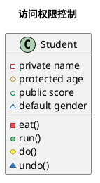

# Learn Design Pattern in Java


## Principles

### 单一职责原则

一个类只负责一项职责

```java
public class singleResponsibility {
    public static void main(String[] args) {
        Vehicle vehicle = new Vehicle();
        vehicle.run("airplane");
        vehicle.run("ship");
        vehicle.run("car");
    }
}

// 违反单一职责
class Vehicle {
    public void run(String vechile) {
        System.out.println(vechile + "running...");
    }
}
```

```java
//改进
public class singleResponsibility {
    public static void main(String[] args) {
        RoadVehicle roadVehicle = new RoadVehicle();
        roadVehicle.run("car");
        WaterVehicle waterVehicle = new WaterVehicle();
        waterVehicle.run("ship");
        AirVehicle airVechile = new AirVehicle();
        airVechile.run("plan");
    }
}

// 遵守单一职责，但是花销大
class RoadVehicle {
    public void run(String vechile) {
        System.out.println(vechile + "running...");
    }
}

class WaterVehicle {
    public void run(String vechile) {
        System.out.println(vechile + "running...");
    }
}

class AirVehicle {
    public void run(String vechile) {
        System.out.println(vechile + "running...");
    }
}
```

### 接口隔离原则

客户端不应该依赖它不需要的接口，即一个类对另一个类的依赖应该建立在最小接口上

```java
// 类A通过接口Interface依赖类B,类C通过接口依赖类D
interface Interface {
    void method1();
    void method2();
    void method3();
    void method4();
    void method5();
}

class B implements Interface1 {
    @Override
    public void method1() {

    }

    @Override
    public void method2() {

    }

    @Override
    public void method3() {

    }

    @Override
    public void method4() {

    }

    @Override
    public void method5() {

    }
}

class D implements Interface1 {
    @Override
    public void method1() {

    }

    @Override
    public void method2() {

    }

    @Override
    public void method3() {

    }

    @Override
    public void method4() {

    }

    @Override
    public void method5() {

    }
}

class A {
    void depend1(Interface1 interface1) {
        interface1.method1();
    }

    void depend2(Interface1 interface1) {
        interface1.method2();
    }

    void depend3(Interface1 interface1) {
        interface1.method3();
    }
}

class C {
    void depend1(Interface1 interface1) {
        interface1.method1();
    }

    void depend4(Interface1 interface1) {
        interface1.method4();
    }

    void depend5(Interface1 interface1) {
        interface1.method5();
    }
}
```

```java
// 将接口拆分为几个独立的接口，类A和类C分别与他们依赖的接口建立依赖关系，实现接口隔离原则
interface Interface2 {
    void method1();
}

interface Interface3 {
    void method2();
    void method3();
}

interface Interface4 {
    void method4();
    void method5();
}

class B2 implements Interface2, Interface3 {
    @Override
    public void method1() {

    }

    @Override
    public void method2() {

    }

    @Override
    public void method3() {

    }
}

class D2 implements Interface2, Interface4 {
    @Override
    public void method1() {

    }

    @Override
    public void method4() {

    }

    @Override
    public void method5() {

    }
}

class A2{
    void depend1(Interface2 interface2) {
        interface2.method1();
    }

    void depend2(Interface3 interface3) {
        interface3.method2();
    }

    void depend3(Interface3 interface3) {
        interface3.method3();
    }
}

class C2 {
    void depend1(Interface2 interface2) {
        interface2.method1();
    }

    void depend4(Interface4 interface4) {
        interface4.method4();
    }

    void depend5(Interface4 interface4) {
        interface4.method5();
    }
}
```

### 依赖倒置原则

- 高层模块不应该依赖低层模块，二者都应该依赖其抽象
- 抽象不应该依赖细节，细节应该依赖抽象
- 依赖倒转(倒置)的中心思想是面向接口编程，不要使用具体的类，使用这个类的抽象
- 依赖倒转原则是基于这样的设计理念：相对于细节的多变性，抽象的东西要稳定的多。以抽象为基础搭建的架构比以细节为基础的架构要稳定的多。在 java 中，抽象指的是接口或抽象类，细节就是具体的实现类
- 使用接口或抽象类的目的是制定好规范，而不涉及任何具体的操作，把展现细节的任务交给他们的实现类去完成

```java
class Email {
    public String getInfo() {
        return "xxxxx";
    }
}

// 接收消息
class Person {
    public void recieve(Email1 email) {
        System.out.println(email.getInfo());
    }
}
// 如果我们获取的对象是 微信，短信等等，则新增类，同时 Perons 也要增加相应的接收方法
// 引入一个抽象的接口 IReceiver, 表示接收者, 这样 Person 类与接口 IReceiver 发生依赖
// 引入一个抽象的接口 IReceiver, 表示接收者, 这样 Person 类与接口 IReceiver 发生依赖
```

依赖关系传递的三种方式：

- 接口传递，作为方法参数
- 构造方法传递
- setter方法传递

```java
interface IReceiver {
    public String getInfo();
}

class Email implements IReciever {
    public String getInfo() {
        return "xxxxx";
    }
}

// 方式一
class Person {
    public void receive(IReceiver ireceiver) {
        System.out.println(ireceiver.getInfo());
    }
}

// 方式二, 利用构造方法
class Person {
    private IReceiver ireceiver;
    
    public Person(IReceiver ireceiver){
        this.ireceiver = ireceiver;
    }

    public void receive() {
        System.out.println(this.ireceiver.getInfo());
    }
}

// 方式三，利用setter
class Person {
    private IReceiver iReceiver;

    public void setIReceiver(IReceiver iReceiver){
        this.iReceiver = iReceiver;
    }

    public void receive() {
        System.out.println(this.ireceiver.getInfo());
    }
}
```

### 里氏替换原则

- 所有引用基类的地方必须能透明地使用其子类
- 在使用继承时，遵循里氏替换原则，在子类中尽量不要重写父类的方法
- 优先使用依赖、聚合组合，再使用继承
- 修改方法：原来的父类和子类都继承一个更通俗的基类，原有的继承关系去掉，采用依赖，聚合，组合等关系代替.

```java
class A {
    public int func1(int a, int b) {
        return a + b;
    }
}
// B继承A
class B extends A {
    // 重写了A类的方法，改变了原有意思
    @Override
    public int func1(int a, int b) {
        return a - b;
    }

    public int func2(int a, int b) {
        return func1(a, b) + 9;
    }
}
```

```java
// 利用里氏替换原则改进
// 创建一个更加基础的基类,原来的父类和子类都继承这个基类，原有的继承关系去掉，采用依赖、聚合组合灯关系替代
class Base {

}

class A1 extends Base {
    public int func1(int a, int b) {
        return a + b;
    }
}

class B1 extends Base {
    private A1 a1 = new A1();

    public int func2(int a, int b) {
        return this.a1.func1(a, b) + 9;
    }
}
```

### 开闭原则

对扩展开发（对提供方），对修改关闭（对使用方）
当软件需要变化时，尽量通过扩展软件实体的行为来实现变化，而不是通过修改已有的代码来实现变化

编程中遵循其他原则和设计模式的目的就是为了达到满足开闭原则

```java
public class OCP {
    public static void main(String[] args) {
        GraphicEditor graphicEditor = new GraphicEditor();
        graphicEditor.drawShape(new Rectangle());
    }
}

// 使用方
class GraphicEditor {
    public void drawShape(Shape shape) {
        shape.draw();
    }
}

// 提供方
interface Shape {
    void draw();
}

class Rectangle implements Shape {
    @Override
    public void draw() {
        System.out.println("Rectangle");
    }
}

class Circle implements Shape {
    @Override
    public void draw() {
        System.out.println("Circle");
    }
}
```

### 迪米特法则

一个对象应该对其他对象保持最少的了解。迪米特法则又被称为最少知道原则
一个类对自己依赖的类知道的越少越好。更简单的理解：只与直接朋友通信

直接朋友：每个对象都会与其他对象有耦合关系，只要两个对象直接有耦合关系，就称两个对象间是朋友关系。耦合的方式有很多：依赖、关联、聚合、组合继承等，其中，出现成员变量、方法参数、方法返回值中的类为直接朋友，出现在局部变量中的类不是直接朋友。即，陌生的类最好不要以局部变量的形式出现在类的内部

类与类的关系越紧密，耦合度越大。迪米特法则核心是降低类之间的耦合。

### 组合复用原则

尽量使用聚合组合的方式，不要使用继承关系

## UML类图

### 访问权限控制



### 类间的关系

- 继承（泛化）
- 实现
- 组合：关联关系的一种特例，他体现的是一种contains-a的关系，这种关系比聚合更强，也称为强聚合；他同样体现整体与部分间的关系，但此时整体与部分是不可分的，整体的生命周期结束也就意味着部分的生命周期结束
- 聚合：关联关系的一种特例，他体现的是整体与部分、拥有的关系，即has-a的关系，此时整体与部分之间是可分离的，他们可以具有各自的生命周期
- 关联：强依赖关系，表现在代码层面，为被关联类B以类属性的形式出现在关联类A中
- 依赖：一个类A使用到了另一个类B，而这种使用关系是具有偶然性的、临时性的、非常弱的，表现在代码层面，为类B作为参数被类A在某个method中使用

```puml
'继承'
Father <|-- Son
'实现'
Vehicle <|.. Car
'组合'
Human *-- Brain
'聚合'
Company o-- Human
'关联， 单向'
Human --> Water
'关联， 双向'
Human -- IDCard
'依赖'
Human ..> Pen
```

## Design Pattern

- 创建型模式：类的创建与使用分离
    - __单例__
    - __工厂（包含简单工厂）__
    - 抽象工厂
    - 原型
    - 建造者
- 结构型模式：软件结构
    - 适配器
    - 桥接
    - __装饰__
    - 组合
    - 外观
    - 享元
    - __代理__
- 行为型模式：方法角度
    - 模板方法
    - 命令
    - 访问者
    - 迭代器
    - __观察者__
    - 中介者
    - 备忘录
    - 解释器
    - 状态
    - __策略__
    - 责任链

### 创建型模式(5种)

__用于描述“怎样创建对象”，它的主要特点是“将对象的创建与使用分离”__

#### 单例模式singleton

某个类只存在一个对象实例

单例的8中方式：

- __饿汉式（静态常量）__
- __饿汉式（静态代码块）__
- 懒汉式（线程不安全）
- 懒汉式（线程安全，同步方法）
- 懒汉式（线程安全，同步代码块）
- __双重检查__
- __静态内部类__
- __枚举__

使用场景

- 频繁创建和销毁的对象
- 工具类对象
- 创建或销毁耗时较多的重量级对象

##### 饿汉式（静态常量）

实现步骤：

1. 构造器私有化
2. 类的内部创建对象
3. 向外暴露一个静态的公共方法返回对象

```java
class Singleton {
    // 构造器私有化
    private Singleton() {
    }

    // 内部创建对象实例
    private final static Singleton instance = new Singleton();

    // 提供一个公有的静态方法，返回实例对象
    public static Singleton getInstance() {
        return instance;
    }
}
```

优点：类加载时就实例化，避免了线程安全
缺点：没有达到懒加载的效果，如果没有使用过这个实例，则会造成内存的浪费

##### 饿汉式（静态代码块）

```java
class Singleton {
    // 构造器私有化
    private Singleton() {
    }

    // 内部创建对象实例
    private static Singleton instance;

    static { // 在静态代码块中创建单例对象
        instance = new Singleton();
    }

    // 提供一个公有的静态方法，返回实例对象
    public static Singleton getInstance() {
        return instance;
    }
}
```

##### 懒汉式（线程不安全）

实现步骤：

1. 构造器私有化
2. 提供一个静态的公有方法，当使用该方法时，才创建对象

```java
public class Singleton {
    private static Singleton singleton;

    public Singleton() {
    }

    public static Singleton getInstance() {
        if (singleton == null) {
            singleton = new Singleton();
        }
        return singleton;
    }
}
```

优点：懒加载
缺点：线程不安全

##### 懒汉式（线程安全，同步方法）

```java
public class Singleton {
    private static Singleton singleton;

    public Singleton() {
    }

    // 这种同步的粒度极大，效率低
    public static synchronized Singleton getInstance() {
        if (singleton == null) {
            singleton = new Singleton();
        }
        return singleton;
    }
}
```

优点：线程安全
缺点：锁粒度大，效率低; 其实只需要执行一次这个方法就可以了，后面直接return就行，方法进行同步效率太低

##### 懒汉式（线程不安全，同步代码块）

```java
public class Singleton {
    private static Singleton singleton;

    private Singleton() {

    }

    public static Singleton getInstance() {
        if (singleton == null) {// 这里还是会引发线程安全问题
            synchronized (Singleton.class) {
                singleton = new Singleton();
            }
        }
        return singleton;
    }
}
```

线程不安全，可能产生多个实例

##### 双重检查

```java
public class Singleton {
    // 修改立即更新到主存, 防止重排序
    private static volatile Singleton singleton;

    private Singleton () {}

    // 解决线程安全和懒加载
    public static Singleton getInstance() {
        if (singleton == null) {
            synchronized (Singleton.class) {
                if (singleton == null) {
                    singleton = new Singleton();
                }
            }
        }
        return singleton;
    }
}
```

- 进行了两次 `if (instance == null)` 判断，保证了线程安全
- 实例化代码只用执行一次，后面再次访问时，直接返回
- 线程安全，懒加载，效率高

##### 静态内部类

```java
public class Singleton {
    private static Singleton singleton;

    // 构造器私有化
    private Singleton() {
    }

    // 写一个静态内部类，该类中有一个静态属性 Singleton
    private static class SingletonInstance {
        private static final Singleton SINGLETON = new Singleton();
    }

    // 提供一个静态的公有方法
    public static Singleton getInstance() {
        return SingletonInstance.SINGLETON;
    }

}
```

- 类加载时，静态内部类不会加载
- 当静态内部类被访问时，会加载，但是只会加载一次
- 懒加载，线程安全

##### 枚举

```java
enum Singleton {
    INSTANCE;
}
```

- 线程安全
- 防止反序列化，重新创建对象


#### 简单工厂模式simpleFactory

一个工厂对象决定创建出哪一种产品类实例。定义了一个创建对象的类，由这个类来封装实例化对象的行为

- 抽象产品
- 具体产品
- 简单工厂

```java
public class TestSimpleFactory {
    public static void main(String[] args) {
        SimpleFactory simpleFactory = new SimpleFactory();
        Pizza pizza = simpleFactory.createPizza("cheese");
        pizza.show();
    }
}

// 抽象产品，只有一个等级产品
interface Pizza {
    public void show();
}

class CheesePizza implements Pizza {
    @Override
    public void show() {
        System.out.println("Cheese Pizza");
    }
}

class PepperPizza implements Pizza {
    @Override
    public void show() {
        System.out.println("Pepper Pizza");
    }
}

// 一个工厂生产同一等级的多个产品
class SimpleFactory {
    public Pizza createPizza(String type) {
        if ("cheese".equals(type)) {
            return new CheesePizza();
        } else if ("pepper".equals(type)) {
            return new PepperPizza();
        } else {
            return null;
        }
    }
}
```

#### 工厂方法模式Factory

定义一个创建对象的抽象方法，由子类决定要实例化的类，工厂方法模式将对象的实例化推迟到了子类

- 抽象产品
- 具体产品
- 抽象工厂
- 具体工厂，与具体产品间一一对应

```java
public class TestFactory {
    public static void main(String[] args) {
        Factory factory = new CheeseFactory();
        Pizza pizza = factory.createPizza();
        pizza.show();
        
        Factory factory1 = new PepperFactory();
        Pizza pizza1 = factory1.createPizza();
        pizza1.show();
    }
}

// 抽象产品，只有一个等级产品
interface Pizza {
    public void show();
}

class CheesePizza implements Pizza {
    @Override
    public void show() {
        System.out.println("Cheese Pizza");
    }
}

class PepperPizza implements Pizza {
    @Override
    public void show() {
        System.out.println("Pepper Pizza");
    }
}

// 抽象工厂
interface Factory {
    public Pizza createPizza();
}

// 具体工厂，一个工厂生产一种产品
class CheeseFactory implements Factory {
    @Override
    public Pizza createPizza() {
        System.out.println("Make Cheese Pizza");
        return new CheesePizza();
    }
}

class PepperFactory implements Factory{
    @Override
    public Pizza createPizza() {
        System.out.println("Make Pepper Pizza");
        return new PepperPizza();
    }
}
```

#### 抽象工厂模式AbstractFactory

是一种为访问类提供一个创建一组相关或相互依赖对象的接口，且访问类无须指定所要产品的具体类就能得到同族的不同等级的产品的模式结构。

抽象工厂模式就是对工厂方法模式进一步抽象。将工厂抽象成两层，抽象工厂和具体实现的工厂子类，这样讲单个的简单工厂类变成了工厂簇，更利于代码的维护和扩展

- 抽象工厂，包含创建多个方法
- 具体工厂
- 抽象产品
- 具体产品，同具体工厂是多对一关系

|----------|第一个产品等级|第二个产品等级|
|----------|-----------|------------|
|第一个产品族|海尔冰箱     |海尔空调     |
|第二个产品族|格力冰箱     |格力空调     |

产品等级：属于同一个抽象产品
产品族：属于同一个具体工厂

- 添加一个产品族时，新增一个具体工厂，满足开闭原则
- 添加一个产品等级时，所有工厂都要修改，不满足开闭原则
- 只有一个产品等级，抽象工厂模式退化为工厂方法模式

```java
// 抽象产品，第一个产品等级
interface Pizza {
    public void show();
}

class CheesePizza implements Pizza {
    @Override
    public void show() {
        System.out.println("Cheese Pizza");
    }
}

class PepperPizza implements Pizza {
    @Override
    public void show() {
        System.out.println("Pepper Pizza");
    }
}

// 抽象产品， 第二个产品等级
interface Hamburger {
    public void show();
}

class BeefHamburger implements Hamburger {
    @Override
    public void show() {
        System.out.println("Beef Hamburger");
    }
}

class ChickenHamburger implements Hamburger {
    @Override
    public void show() {
        System.out.println("Chicken Hamburger");
    }
}

// 抽象工厂
interface AbsFactory {
    public Pizza createPizza();

    public Hamburger createHamburger();
}

// 具体工厂， 一个工厂生产不同等级的多个产品，第一个产品族
class LDFactory implements AbsFactory {
    @Override
    public Pizza createPizza() {
        System.out.println("LD Factory making Pizza");
        return new CheesePizza();
    }

    @Override
    public Hamburger createHamburger() {
        System.out.println("LD Factory baking Hamburger");
        return new BeefHamburger();
    }
}

// 具体工厂， 第二个产品族
class NYFactory implements AbsFactory {
    @Override
    public Pizza createPizza() {
        System.out.println("NY Factory making pizza");
        return new PepperPizza();
    }

    @Override
    public Hamburger createHamburger() {
        System.out.println("NY Factory baking hamburger");
        return new ChickenHamburger();
    }
}

```

- 简单工厂：一个工厂生产同一产品等级的多种产品，通过if-else决定生产哪种产品
- 工厂方法：一个工厂只生产一种产品，这样避免了简单工厂的if-else判断
- 抽象工厂：一个工厂可以生产不同产品等级的多种产品，这一组产品成为一个产品族; 无法做到一个工厂生产同一产品等级的多种产品，除非有if-else判断，或添加方法

#### 原型模式ProtoType

Java中Object类是所有类的根类，Object类提供了一个clone方法，可以复制Java对象，但是该类需要实现Cloneable接口，该接口表示该类具有能够复制的能力

原型模式：用原型实例指定创建对象的种类，并且通过拷贝这些原型，创建新的对象

- 抽象原型类：规定原型对象必须实现的接口
- 具体原型类：实现抽象原型类的clone()方法
- 访问类：使用具体原型类中的clone()方法来复制新对象

```java
// 访问类进行测试
public class TestPrototype {
    public static void main(String[] args) throws CloneNotSupportedException {
        Sheep sheep = new Sheep("doli", 10);
        Sheep sheep1 = (Sheep)sheep.clone(); // 完成克隆
    }
}

// 抽象原型类 Cloneable

// 具体原型类
class Sheep implements Cloneable {
    private String name;
    private int age;

    public Sheep(String name, int age) {
        this.name = name;
        this.age = age;
    }

    public String getName() {
        return name;
    }

    public void setName(String name) {
        this.name = name;
    }

    public int getAge() {
        return age;
    }

    public void setAge(int age) {
        this.age = age;
    }

    @Override
    protected Object clone() throws CloneNotSupportedException {
        return (Sheep)super.clone();
    }
}
```

- 浅克隆：创建一个新对象，新对象的属性和原来对象完全相同，对于非基本类型属性，仍指向原有属性所指向的对象的内存地址。
- 深克隆：创建一个新对象，属性中引用的其他对象也会被克隆，不再指向原有对象地址。

#### 建造者模式Builder

可以将复杂对象的建造过程抽象出来，使这个抽象过程的不同实现方法可以构建出不同表现的对象

- 产品：具体产品
- 抽象建造者：创建产品的接口
- 具体建造者：实现接口，完成具体各个部件的构建
- 指挥者：创建复制对象，既可以隔离客户与对象的生产过程，又可以充值产品对象的生产过程

 ```java
public class TestBuilder {
    public static void main(String[] args) {
        Direct direct = new Direct(new CommonHouseBuilder());
        House house = direct.constructHouse();
        System.out.println(house);
    }
}

// 产品
class House {
    private String base;
    private String wall;
    private String roof;

    public void buildBase(String base) {
        this.base = base;
    }

    public void buildWall(String wall) {
        this.wall = wall;
    }

    public void buildRoof(String roof) {
        this.roof = roof;
    }

    @Override
    public String toString() {
        return this.base + this.wall + this.roof;
    }
}

// 抽象建造者
interface HouseBuilder {
    House house = new House();

    void buildBase();

    void buildWall();

    void buildRoof();

    House buildHouse();
}

// 具体建造者
class CommonHouseBuilder implements HouseBuilder {
    @Override
    public House buildHouse() {
        return house;
    }

    @Override
    public void buildBase() {
        System.out.println("build common house base");
        house.buildBase("Black");
    }

    @Override
    public void buildWall() {
        System.out.println("build common house wall");
        house.buildWall("White");
    }

    @Override
    public void buildRoof() {
        System.out.println("build common house roof");
        house.buildRoof("Red");
    }
}

class HighHouseBuilder implements HouseBuilder {
    @Override
    public void buildBase() {
        System.out.println("build high house base");
        house.buildBase("White");
    }

    @Override
    public void buildWall() {
        System.out.println("build high house wall");
        house.buildWall("White");
    }

    @Override
    public void buildRoof() {
        System.out.println("build high house roof");
        house.buildRoof("Blue");
    }

    @Override
    public House buildHouse() {
        return house;
    }
}

// 指挥者
class Direct {
    private HouseBuilder houseBuilder;

    public Direct(HouseBuilder houseBuilder) {
        this.houseBuilder = houseBuilder;
    }

    public House constructHouse() {

        this.houseBuilder.buildBase();
        this.houseBuilder.buildWall();
        this.houseBuilder.buildRoof();

        return houseBuilder.buildHouse();
    }
} 
```

- 工厂模式强调不同工厂创建了不同产品，即对象实例
- 建造者模式强调同类的不同产品的构建过程

### 结构型模式(7种)

__用于描述如何将类或对象按某种布局组成更多的结构__


#### 适配器模式Adapter

将一个类的接口转换成客户希望的另外一个接口，使得原本由于接口不兼容而不能一起工作的那些类能一起工作

- target: 目标接口
- adaptee: 被适配对象
- adapter： 转换器，通过继承或引用适配者的对象，把适配者接口转换成目标接口，让客户按目标接口的格式访问适配者

例子：将USB接口适配VGA接口

##### 类适配器

adapter继承adaptee 实现 target

```java
/**
 * 类适配器，adapter继承adaptee 实现 target
 */
public class TestAdapter {
    public static void main(String[] args) {
        VGA vga = new AdapterUSB2VGA();
        vga.projection();
    }
}

// 目标接口 target
interface VGA {
    public void projection();
}

// 被适配对象 adaptee
interface USB {
    public void show();
}

class USBImpl implements USB {
    @Override
    public void show() {
        System.out.println("显示PPT");
    }
}

// adapter
class AdapterUSB2VGA extends USBImpl implements VGA {
    @Override
    public void projection() {
        super.show();
    }
}

```

##### 对象适配器

adapter的一个成员变量是adaptee，adapter实现target

```java
/**
 * 对象适配器， adapter的一个成员变量是adaptee，adapter实现target
 * 
 * 使用组合
 */
public class TestAdapter {
    public static void main(String[] args) {
        USB usb = new USBImpl();
        VGA vga = new AdapterUSB2VGA(usb);
        vga.projection();
    }
}

// target
interface VGA {
    public void projection();
}

// adaptee
interface USB {
    public void show();
}

class USBImpl implements USB {
    @Override
    public void show() {
        System.out.println("show PPT");
    }
}

// adapter
class AdapterUSB2VGA implements VGA {
    private USB usb;

    public AdapterUSB2VGA(USB usb) {
        this.usb = usb;
    }

    @Override
    public void projection() {
        usb.show();
    }
}
```

##### 接口适配器

- 可以看成对象适配器的扩展
- 接口适配器， 同对象适配器一样，adapter拥有adaptee为成员变量，adapter实现target
- 当不需要全部实现接口提供的方法时，可先设计一个抽象类实现接口，并为该接口中每个方法提供一个默认实现（空方法），那么该抽象类的子类可有选择地覆盖父类的某些方法来实现需求，它适用于一个接口不想使用其所有的方法的情况

```java
/**
 * 接口适配器， 同对象适配器一样，adapter拥有adaptee为成员变量，adapter实现target
 *
 * 当不需要全部实现接口提供的方法时，可先设计一个抽象类实现接口，并为该接口中每个方法提供一个默认实现（空方法），那么该抽象类的子类可有选择地覆盖父类的某些方法来实现需求，它适用于一个接口不想使用其所有的方法的情
 */
public class TestAdapter {
}

// target
interface VGA {
    public void project();

    // 接口中有不需要使用或不想实现的方法
    public void b();

    public void c();
}

// adaptee
interface USB {
    public void show();
}

class USBImpl implements USB {
    @Override
    public void show() {
        System.out.println("show PPT");
    }
}

// adapter
abstract class AdapterUSB2VGA implements VGA {
    USB usb = new USBImpl();

    @Override
    public void project() {
        usb.show();
    }

    @Override
    public void b() {

    }

    @Override
    public void c() {

    }
}


class AdapterUSB2VGAImpl extends AdapterUSB2VGA {
    // AdapterUSB2VGA实现，不用去实现b()和c()方法。
    @Override
    public void project() {
        super.project();
    }
}

```

- 类适配器：adapter继承adaptee，不推荐
- 对象适配器：adapter与adaptee关系是组合关系，推荐
- 接口适配器：adapter与adaptee关系是组合关系，推荐，适用于target中有不需要的接口

#### 桥接模式Bridge

将实现与抽象放在两个不同的类层次中，使得两个层次可以独立改变

- 实现化Implementor，定义实现化角色的接口
- 具体实现化ConcreteImplementor
- 抽象化Abstraction，包含一个对实现化的引用
- 扩展抽象化RefinedAbstration

```java
/**
 * 桥接模式
 */
public class TestBridge {
    public static void main(String[] args) {
        Phone phone = new Xiaomi();
        phone.setSoftware(new WeChat());
        phone.run();
    }
}

// implementor
interface Software {
    public void run();
}

// concrete implementor
class WeChat implements Software {
    @Override
    public void run() {
        System.out.println("run wechat");
    }
}

class AliPay implements Software {
    @Override
    public void run() {
        System.out.println("run alipay");
    }
}

// Abstraction
abstract class Phone {
    protected Software software;

    public void setSoftware(Software software) {
        this.software = software;
    }

    public abstract void run();
}

// RefinedAbstraction
class Xiaomi extends Phone {
    @Override
    public void run() {
        software.run();
    }
}

class Huawei extends Phone {
    @Override
    public void run() {
        software.run();
    }
}
```

#### 装饰者模式Decorator

动态的将新功能附加到对象上。在对象功能扩展方面，它比继承更有弹性，符合开闭原则

- component(被装饰对象的基类):定义一个对象接口，可以给这些对象动态添加职责
- concrete_component(具体被装饰对象):
- Decorator(装饰抽象类):维持一个指向component实例的引用，并定义一个与component接口一致的接口
- concrete_decorator(具体装饰者)

- 被装饰对象与装饰者继承自同一个超类
- 被装饰者与装饰者间的关系是聚合，装饰者有个指向被装饰者的成员变量

```java
/**
 * 装饰者模式
 */
public class TestBridge {
    public static void main(String[] args) {
        Drink order;
        order = new Decaf();
        System.out.println("order1 price: " + order.cost());
        System.out.println("order1 desc: " + order.getDescription());

        order = new Milk(order);
        order = new Ice(order);
        System.out.println("order2 price: " + order.cost());
        System.out.println("order2 desc: " + order.getDescription());
    }
}

// 超类
abstract class Drink {
    public String description = "";
    private double price = 0;

    public String getDescription() {
        return description + "-" + this.getPrice();
    }

    public void setDescription(String description) {
        this.description = description;
    }

    public double getPrice() {
        return price;
    }

    public void setPrice(double price) {
        this.price = price;
    }

    public abstract double cost();
}

// component
class Coffee extends Drink {
    @Override
    public double cost() {
        return super.getPrice();
    }
}

// concrete component
class Decaf extends Coffee {
    public Decaf() {
        super.setDescription("Decaf");
        super.setPrice(3);
    }
}

class Latte extends Coffee {
    public Latte() {
        super.setDescription("Latte");
        super.setPrice(4);
    }
}

// Decorator
class Decorator extends Drink {
    private Drink obj;

    public Decorator(Drink obj) {
        this.obj = obj;
    }

    @Override
    public double cost() {
        return super.getPrice() + obj.cost();
    }

    @Override
    public String getDescription() {
        return super.getDescription() + "&&" + obj.getDescription();
    }
}

// concrete decorator
class Milk extends Decorator {
    public Milk(Drink obj) {
        super(obj);
        super.setDescription("Milk");
        super.setPrice(2);
    }
}

class Ice extends Decorator {
    public Ice(Drink obj) {
        super(obj);
        super.setDescription("Ice");
        super.setPrice(1);
    }
}
```

#### 组合模式Composite

又称为部分-整体模式，它是一种将对象组合成树状的层次结构的模式，用来表示部分-整体关系，使用户对单个对象和组合对象具有一致性的访问，适用于树形数据结构且树枝和叶子接近的情况

- 抽象构建component: 作为树枝构件和树叶构件的公共接口，实现它们的默认行为
- 树枝构件composite：组合模式中的分支节点对象，具有子节点
- 树叶构件leaf：组合模式中的叶子节点，没有子节点

```java
/**
 * 组合模式
 */
public class TestComposite {
    public static void main(String[] args) {
        Component California = new State("California");
        California.add(new City("San Francisco"));
        California.add(new City("Los Angeles"));
        California.show();
    }
}

// component
interface Component {
    public void add(Component component);

    public void remove(Component component);

    public void show();
}

// leaf
class City implements Component{
    private String name;

    public City(String name) {
        this.name = name;
    }

    @Override
    public void add(Component component) {
        throw new UnsupportedOperationException();
    }

    @Override
    public void remove(Component component) {
        throw new UnsupportedOperationException();
    }

    @Override
    public void show() {
        System.out.println(name);
    }
}

// composite
class State implements Component {
    private String name;
    private ArrayList<Component> cities = new ArrayList<Component>();

    public State(String name) {
        this.name = name;
    }

    @Override
    public void add(Component component) {
        cities.add(component);
    }

    @Override
    public void remove(Component component) {
        cities.remove(component);
    }

    @Override
    public void show() {
        System.out.println(name);
        for (Component component :
                cities) {
            component.show();
        }
    }
}
```

#### 外观模式Facade

隐藏了系统的复杂性，并向客户端提供了一个可以访问系统的接口

- 门面角色：外观模式的核心。它被客户角色调用，它熟悉子系统的功能,客户调用，同时自身调用子系统功能
- 子系统角色: 实现了子系统的功能
- 客户角色: 调用门面角色

```java
/**
 * 外观模式
 */
public class TestFacade {
    public static void main(String[] args) {
        Computer computer = new Computer();
        computer.start();
        computer.stop();
    }
}

// 子系统
class CPU {
    public void start() {
        System.out.println("cpu is start");
    }

    public void stop() {
        System.out.println("cpu is shut down");
    }
}

class Memory {
    public void start() {
        System.out.println("memory is start");
    }

    public void stop() {
        System.out.println("memory is shut down");
    }
}

class Disk {
    public void start() {
        System.out.println("disk is start");
    }

    public void stop() {
        System.out.println("disk is shut down");
    }
}

// Facade
class Computer {
    private CPU cpu;
    private Memory memory;
    private Disk disk;

    public Computer() {
        cpu = new CPU();
        memory = new Memory();
        disk = new Disk();
    }

    public void start() {
        System.out.println("computer start begin");
        cpu.start();
        memory.start();
        disk.start();
        System.out.println("computer start end");
    }

    public void stop() {
        System.out.println("computer stop begin");
        cpu.stop();
        memory.stop();
        disk.stop();
        System.out.println("computer stop end");
    }
}
```

- 使得客户端和子系统之间解耦
- 维护一个遗留大型系统时，可这个系统已经非常难以维护，可以考虑为新系统开发一个外观类，来提供遗留系统的比较清晰简单的接口

#### 享元模式Flyweight

有大量对象存在时，将其中共同的部分抽象出来，如果有相同业务请求，直接返回在内存中已有的对象

将共同对象放在一个HashMap池子中，根据唯一标识取出对象

- Flyweight享元抽象类：定义了享元类的公共方法。这些方法可以分享内部状态的数据，也可以调用这些方法修改外部状态
- ConcreteFlyweight具体享元类
- FlyweightFactory享元工厂类：享元工厂类创建并且管理享元类，通过提供一个享元池来进行享元对象的管理。一般享元池设计成键值对，或者其他的存储结构来存储。当客户端进行享元对象的请求时，如果享元池中有对应的享元对象则直接返回对应的对象，否则工厂类创建对应的享元对象并保存到享元池

```java
/**
 * 享元模式
 */
public class TestFlyweight {
    public static void main(String[] args) {
        FlyweightFactory flyweightFactory = new FlyweightFactory();
        Flyweight flyweight1 = flyweightFactory.getFlyweight("a");
        Flyweight flyweight2 = flyweightFactory.getFlyweight("b");
        Flyweight flyweight3 = flyweightFactory.getFlyweight("b");
        flyweight1.show();
        flyweight2.show();
        flyweight3.show();
        System.out.println(flyweightFactory.getFlyweightSize());
    }
}

// 享元接口
interface Flyweight {
    void show();
}

// 具体享元
class ConcreteFlyweight implements Flyweight {
    private String id;

    public ConcreteFlyweight(String id) {
        this.id = id;
    }

    @Override
    public void show() {
        System.out.println(id);
    }
}

// 享元工厂
class FlyweightFactory {
    private HashMap<String, Flyweight> pool = new HashMap<>();

    public Flyweight getFlyweight(String str) {
        if (!pool.containsKey(str)) {
            pool.put(str, new ConcreteFlyweight(str));
        }
        return pool.get(str);
    }

    public int getFlyweightSize() {
        return pool.size();
    }
}
```

#### 代理模式Proxy

给某一个对象提供一个代理对象，并由代理对象控制对原对象的引用

- 静态代理
- 动态代理
- Cglib代理

##### 静态代理

静态代理在使用时，需要定义接口或父类，代理对象与委托对象都实现相同接口或继承相同父类

```java
interface BuyHouse {
    void buy();
}

// 被代理着
class BuyHouseImpl implements BuyHouse {
    @Override
    public void buy() {
        System.out.println("i want to buy house");
    }
}

// proxy
class BuyHouseProxy implements BuyHouse {
    private BuyHouse buyHouse;

    public BuyHouseProxy(BuyHouse buyHouse) {
        this.buyHouse = buyHouse;
    }

    @Override
    public void buy() {
        buyHouse.buy();
        System.out.println("proxy");
    }
}
```

代理对象与目标对象要实现相同的接口，我们得为每一个服务都得创建代理类，工作量太大

##### 动态代理

又称为JDK代理，利用Java.lang.reflect.Proxy类生成一个代理对象

- 代理对象不需要实现接口
- 代理对象的生成,是利用JDK的API,动态的在内存中构建代理对象(需要指定创建代理对象/目标对象实现的接口的类型)

动态代理实现：

Java.lang.reflect.Proxy类可以直接生成一个代理对象

    Proxy.newProxyInstance(ClassLoader loader, Class<?>[] interfaces, InvocationHandler h)生成一个代理对象

        参数1:ClassLoader loader 代理对象的类加载器 一般使用被代理对象的类加载器

        参数2:Class<?>[] interfaces 代理对象的要实现的接口 一般使用的被代理对象实现的接口

        参数3:InvocationHandler h (接口)执行处理类

    InvocationHandler中的invoke(Object proxy, Method method, Object[] args)方法：调用代理类的任何方法，此方法都会执行

        参数3.1:代理对象(慎用)

        参数3.2:当前执行的方法

        参数3.3:当前执行的方法运行时传递过来的参数

```java
// 测试类
public class TestProxy {
    public static void main(String[] args) {
        BuyHouse buyHouse = new BuyHouseImpl();
        // 创建代理
        BuyHouse proxyBuyHouse = (BuyHouse) Proxy.newProxyInstance(BuyHouse.class.getClassLoader(), new Class[]{BuyHouse.class}, new DynamicHandler(buyHouse));
        proxyBuyHouse.buy();
    }
}

interface BuyHouse {
    void buy();
}

class BuyHouseImpl implements BuyHouse {

    @Override
    public void buy() {
        System.out.println("i want to buy house");
    }
}

// 动态处理器
class DynamicHandler implements InvocationHandler {
    private Object object;

    public DynamicHandler(Object object) {
        this.object = object;
    }

    @Override
    public Object invoke(Object proxy, Method method, Object[] args) throws Throwable {
        Object result = method.invoke(object, args);
        System.out.println("i am proxy, i'd like to help you buy house");
        return result;
    }
}
```

虽然相对于静态代理，动态代理大大减少了我们的开发任务，同时减少了对业务接口的依赖，降低了耦合度。但是还是有一点点小小的遗憾之处，那就是它始终无法摆脱仅支持interface代理的桎梏

##### CGlib

动态生成一个要代理类的子类，子类重写要代理的类的所有不是final的方法。在子类中采用方法拦截的技术拦截所有父类方法的调用，顺势织入横切逻辑。它比使用java反射的JDK动态代理要快。

```java
public class TestCGlib {
    public static void main(String[] args) {
        BuyHouse buyHouse = new BuyHouseImpl();
        ProxyFactory proxyFactory = new ProxyFactory();
        BuyHouse proxyBuyHouse = (BuyHouse) proxyFactory.getProxyInstance(buyHouse);
        proxyBuyHouse.buy();
    }
}

interface BuyHouse {
    void buy();
}

class BuyHouseImpl implements BuyHouse {
    @Override
    public void buy() {
        System.out.println("i want to buy house");
    }
}

class ProxyFactory implements MethodInterceptor {

    public Object getProxyInstance(final Object target) {
        // 创建一个工具类
        Enhencer enhencer = new Enhencer();
        // 设置父类
        enhencer.setSuperclass(target.getClass());
        // 设置毁掉函数
        enhencer.setCallback(this);
        // 创建子类对象，即代理对象
        return enhencer.create();
    }

    // 重写方法，会调用目标对象的方法
    /**
     *
     * @param object Object为由CGLib动态生成的代理类实例
     * @param method Method为上文中实体类所调用的被代理的方法引用
     * @param args Object[]为参数值列表
     * @param methodProxy MethodProxy为生成的代理类对方法的代理引用
     * @return
     * @throws Throwable
     */
    @Override
    public Object intercept(Object object, Method method, Object[] args, MethodProxy methodProxy) throws Throwable {
        System.out.println("买房前准备");
        Object result = methodProxy.invoke(object, args);
        return result;
    }
}
```

### 行为型模式(11种)

__用于描述类或对象之间怎样相互协作共同完成单个对象都无法单独完成的任务，以及怎样分配职责__


#### 模板方法Template

定义一个操作中算法的骨架，而将一些步骤延迟到子类中，模板方法使得子类可以不改变算法的结构即可重定义该算法的某些特定步骤。

```java
public class TestTemplate {
    public static void main(String[] args) {
        SoyMilk beanSoyMilk = new BeanSoyMilk();
        beanSoyMilk.create();

        SoyMilk peanutSoyMilk = new PeanutSoyMilk();
        peanutSoyMilk.create();
    }
}

abstract class SoyMilk {
    // 可以定义为final，让子类无法重写
    final void create() {
        prepare();
        make();
        if (isPack()) {
            pack();
        }
    }

    abstract void prepare();

    abstract void make();

    void pack() {
        System.out.println("打包");
    }

    // 可以添加钩子方法
    boolean isPack() {
        return true;
    }
}

class BeanSoyMilk extends SoyMilk {
    @Override
    void prepare() {
        System.out.println("select beans");
    }

    @Override
    void make() {
        System.out.println("making");
    }
}

class PeanutSoyMilk extends SoyMilk {
    @Override
    void prepare() {
        System.out.println("select peanut");
    }

    @Override
    void make() {
        System.out.println("making");
    }

    // 重写钩子方法，控制流程
    @Override
    boolean isPack() {
        return false;
    }
}
```

#### 策略模式Strategy

策略模式定义了一系列算法，并将每个算法封装起来，使他们可以相互替换，且算法的变化不会影响到使用算法的客户。

- 抽象策略
- 具体策略
- 环境角色

```java
// strategy
public interface Vehicle {
    public void run();
}
```

```java
// concrete strategy
public class Car implements Vehicle {
    @Override
    public void run() {
        System.out.println("开车回家");
    }
}
```

```java
public class Subway implements Vehicle {
    @Override
    public void run() {
        System.out.println("坐地铁回家");
    }
}
```

```java
// context
public class Person {
    private Vehicle vehicle;

    public Person(Vehicle vehicle) {
        this.vehicle = vehicle;
    }

    public void goHome() {
        vehicle.run();
    }
}
```

```java
public class Test {
    public static void main(String[] args) {
        Person zhangSan = new Person(new Car());
        zhangSan.goHome();

        Person liSi = new Person(new Subway());
        liSi.goHome();
    }
}
```

- 算法可以自由切换
- 避免使用多重条件判断
- 扩展性良好

#### 命令模式Command

将请求封装为一个对象，使发出请求的责任和执行请求的责任分开，这样两者之间通过命令对象进行沟通，这样方便将命令对象进行储存、传递、调用、增加与管

- 抽象命令类
- 具体命令类
- 实现者/接收者：执行命令功能相关操作
- 调用者/请求者

```java
public class TestCommand {
    public static void main(String[] args) {
        Light light = new Light();
        Command turnOnLight = new TurnOnLight(light);
        Contral contral = new Contral();
        contral.commandExecute(turnOnLight);
        contral.commandUndo(turnOnLight);
    }
}

// command
interface Command {
    public void execute();

    public void undo();
}

class TurnOnLight implements Command {
    private Light light;

    public TurnOnLight(Light light) {
        this.light = light;
    }

    @Override
    public void execute() {
        light.on();
    }

    @Override
    public void undo() {
        light.off();
    }
}

// receiver
class Light {
    public void on() {
        System.out.println("Light on");
    }

    public void off() {
        System.out.println("Light off");
    }
}

// invoker
class Contral {
    public void commandExecute(Command command) {
        command.execute();
    }

    public void commandUndo(Command command) {
        command.undo();
    }
}

```

#### 访问者模式Visitor

一种将数据操作和数据结构分离的设计模式.对象结构比较稳定，但经常需要在此对象结构上定义新的操作

- 抽象元素: 定义了一个接受访问者（accept）的方法，其意义是指每一个元素都要可以被访问者访问
- 具体元素
- 抽象访问者: 定义了对每个 Element 访问的行为，它的参数就是被访问的元素，它的方法个数理论上与元素的个数是一样的，因此，访问者模式要求元素的类型要稳定，如果经常添加、移除元素类，必然会导致频繁地修改 Visitor 接口，如果出现这种情况，则说明不适合使用访问者模式
- 具体元素
- 对象结构ObjectStructure: 内部管理了元素集合，并且可以迭代这些元素提供访问者访问

```java
public class TestVisitor {
    public static void main(String[] args) {
        ComputerStore computerStore = new ComputerStore();
        computerStore.showPrice(new StudentBuyer("foobar"));
        computerStore.showPrice(new CompanyBuyer("Apple"));
        computerStore.showPrice(new PersonalBuyer("somebody"));
    }
}

// 抽象元素
interface ComputerPart {
    void accept(Visitor visitor);
}

// 具体元素
class CPU implements ComputerPart {
    private double price;

    public CPU(double price) {
        this.price = price;
    }

    public double getPrice() {
        return price;
    }

    @Override
    public void accept(Visitor visitor) {
        visitor.visit(this);
    }
}

class Memory implements ComputerPart {
    private double price;

    public double getPrice() {
        return price;
    }

    public Memory(double price) {
        this.price = price;
    }

    @Override
    public void accept(Visitor visitor) {
        visitor.visit(this);
    }
}

class Disk implements ComputerPart {
    private double price;

    public double getPrice() {
        return price;
    }

    public Disk(double price) {
        this.price = price;
    }

    @Override
    public void accept(Visitor visitor) {
        visitor.visit(this);
    }
}

// 抽象访问者
interface Visitor {
    void visit(CPU cpu);

    void visit(Memory memory);

    void visit(Disk disk);
}

// 具体访问者
class StudentBuyer implements Visitor {
    private String name;

    public StudentBuyer(String name) {
        this.name = name;
    }

    @Override
    public void visit(CPU cpu) {
        System.out.println("Student: " + name + " buy cpu, and price is: " + cpu.getPrice() * 0.9);
    }

    @Override
    public void visit(Memory memory) {
        System.out.println("Student: " + name + " buy cpu, and price is: " + memory.getPrice() * 0.85);
    }

    @Override
    public void visit(Disk disk) {
        System.out.println("Student: " + name + " buy cpu, and price is: " + disk.getPrice() * 0.8);
    }
}

class CompanyBuyer implements Visitor {
    private String name;

    @Override
    public void visit(CPU cpu) {
        System.out.println("Company: " + name + " buy cpu, and price is: " + cpu.getPrice() * 0.7);
    }

    @Override
    public void visit(Memory memory) {
        System.out.println("Student: " + name + " buy cpu, and price is: " + memory.getPrice() * 0.7);
    }

    @Override
    public void visit(Disk disk) {
        System.out.println("Student: " + name + " buy cpu, and price is: " + disk.getPrice() * 0.7);
    }

    public CompanyBuyer(String name) {
        this.name = name;
    }
}

class PersonalBuyer implements Visitor {
    private String name;

    @Override
    public void visit(CPU cpu) {
        System.out.println("Student: " + name + " buy cpu, and price is: " + cpu.getPrice());
    }

    @Override
    public void visit(Memory memory) {
        System.out.println("Student: " + name + " buy cpu, and price is: " + memory.getPrice());
    }

    @Override
    public void visit(Disk disk) {
        System.out.println("Student: " + name + " buy cpu, and price is: " + disk.getPrice());
    }

    public PersonalBuyer(String name) {


        this.name = name;
    }
}

// ObjectStructure
class ComputerStore {
    private List<ComputerPart> goods = new LinkedList<>();

    public ComputerStore() {
        goods.add(new CPU(1000));
        goods.add(new Memory(500));
        goods.add(new Disk(500));
    }

    public void showPrice(Visitor visitor) {
        for (ComputerPart part : goods) {
            part.accept(visitor);
        }
    }
}
```

- 各角色职责分离，数据结构和操作解耦，符合单一原则
- 具有优秀扩展性，灵活性

- 访问者知道元素细节，违反迪米特法则
- 元素变更修改成本大
- 访问者的visit方法中，依赖了具体类，违反依赖倒置

#### 迭代器模式Iterator

提供一种方法顺序访问一个聚合对象中各个元素, 而又无须暴露该对象的内部表示.

简单来说，不同种类的对象可能需要不同的遍历方式，我们对每一种类型的对象配一个迭代器，最后多个迭代器合成一个

- 迭代器角色: 定义遍历元素所需要的方法，一般来说会有这么三个方法：取得下一个元素的方法next()，判断是否遍历结束的方法hasNext()），移出当前对象的方法remove()
- 具体迭代器角色
- 容器角色:  一般是一个接口，提供一个iterator()方法
- 具体容器角色

```java
public class TestIterator {
    public static void main(String[] args) {
        ArrayList<Iterator> iterators = new ArrayList<Iterator>();
        CakeMenu cakeMenu = new CakeMenu();
        DinerMenu dinerMenu = new DinerMenu();
        iterators.add(cakeMenu.getIterator());
        iterators.add(dinerMenu.getIterator());
        for (Iterator iterator : iterators) {
            System.out.println("===============");
            while (iterator.hasNext()) {
                String menu = (String)iterator.next();
                System.out.println(menu);
            }
        }
    }
}

// iterator
interface Iterator {
    public boolean hasNext();

    public Object next();

    public void remove();
}

// aggregate
interface Menu {
    public Iterator getIterator();
}

// concrete aggregate
class CakeMenu implements Menu {
    private ArrayList<String> menus = new ArrayList<String>();

    public CakeMenu() {
        menus.add("KFC cake");
        menus.add("Stawberry cake");
        menus.add("MDL cake");
        menus.add("Regular cake");
    }

    @Override
    public Iterator getIterator() {
        return new CakeMenuIterator();
    }

    // concrete iterator 内部类
    class CakeMenuIterator implements Iterator {

        private int position = 0;

        public CakeMenuIterator() {
            this.position = 0;
        }

        @Override
        public boolean hasNext() {
            if (position < menus.size()) {
                return true;
            }
            return false;
        }

        @Override
        public Object next() {
            String menu = menus.get(position);
            position++;
            return menu;
        }

        @Override
        public void remove() {

        }
    }

}

class DinerMenu implements Menu {
    private int numberOfItems = 0;
    private String[] menus;

    public DinerMenu() {
        menus = new String[5];
        menus[numberOfItems] = "fish";
        menus[numberOfItems] = "beef";
        menus[numberOfItems] = "soup";
        menus[numberOfItems] = "vegetavble";
    }

    @Override
    public Iterator getIterator() {
        return new DinerMenuIterator();
    }

    // concrete iterator
    class DinerMenuIterator implements Iterator {
        private int position = 0;

        @Override
        public boolean hasNext() {
            return position < numberOfItems;
        }

        @Override
        public Object next() {
            String menu = menus[position];
            position++;
            return menu;
        }

        @Override
        public void remove() {

        }
    }
}

```

- 它支持以不同的方式遍历一个聚合对象
- 迭代器简化了聚合类
- 在同一个聚合上可以有多个遍历
- 在迭代器模式中，增加新的聚合类和迭代器类都很方便，无须修改原有代码

- 由于迭代器模式将存储数据和遍历数据的职责分离，增加新的聚合类需要对应增加新的迭代器类，类的个数成对增加，这在一定程度上增加了系统的复杂性

#### 观察者Observer

定义对象间的一种一对多的依赖关系，当一个对象的状态发生改变时，所有依赖于它的对象都得到通知并被自动更新

一个对象（目标对象）的状态发生改变，所有的依赖对象（观察者对象）都将得到通知，进行广播通知

- 抽象主题Subject：它把所有对观察者对象的引用保存在一个集合中，每个主题都可以有任意数量的观察者。抽象主题提供一个接口，可以增加和删除观察者角色。一般用一个抽象类和接口来实现
- 具体主题
- 抽象观察者Observer：为所有的具体观察者定义一个接口，在得到主题通知时更新自己
- 具体观察者

 ```java
public class TestObserver {
    public static void main(String[] args) {
        WechatServer wechatServer = new WechatServer();
        Observer userZhang = new User("Zhang");
        Observer userLi = new User("Li");
        Observer userWang = new User("Wang");
    
        wechatServer.registerObserver(userZhang);
        wechatServer.registerObserver(userLi);
        wechatServer.registerObserver(userWang);
        
        wechatServer.setMessage("What a nice day!");

        wechatServer.removeObserver(userWang);
        wechatServer.setMessage("What a bad day!");
    }
}

interface Subject {
    public void registerObserver(Observer observer);
    public void removeObserver(Observer observer);
    public void notifyObserver();
}
// 微信公众号服务， 具体主题 concrete subject
class WechatServer implements Subject {
    private List<Observer> observers;
    private String message;

    public WechatServer() {
        observers = new ArrayList<Observer>();
    }

    @Override
    public void registerObserver(Observer observer) {
        observers.add(observer);
    }

    @Override
    public void removeObserver(Observer observer) {
        if (!observers.isEmpty()) {
            observers.remove(observer);
        }
    }

    @Override
    public void notifyObserver() {
        for (Observer observer :
                observers) {
            observer.update(message);
        }
    }

    public void setMessage(String message) {
        this.message = message;
        System.out.println("微信公众号更新...");
        notifyObserver();
    }
}

public interface Observer {
    public void update(String message);
}
// 关注公众号的用户，具体观察者 concrete observer
class User implements Observer {
    private String name;

    public User(String name) {
        this.name = name;
    }

    @Override
    public void update(String message) {
        System.out.println(this.name + "read" + message);
    }
}
```

#### 中介者模式Mediator

定义一个中介对象来封装一系列对象之间的交互，使原有对象之间的耦合松散，且可以独立地改变它们之间的交互。中介者模式又叫调停模式，它是迪米特法则的典型应用

- 抽象中介者: 提供了同事对象注册与转发同事对象信息的抽象方法
- 具体中介者: 实现中介者接口，定义一个 List 来管理同事对象，协调各个同事角色之间的交互关系
- 抽象同事类: 定义同事类的接口，保存中介者对象，提供同事对象交互的抽象方法，实现所有相互影响的同事类的公共功能
- 具体同事类: 是抽象同事类的实现者，当需要与其他同事对象交互时，由中介者对象负责后续的交互


```java
public interface Mediator {
    public void register(Colleague colleague); // 注册客户

    public void relay(String from, String to, String msg);  // 转发
}
```

```java
public abstract class Colleague {
    protected Mediator mediator;
    protected String name;

    public void setMedium(Mediator mediator) {
        this.mediator = mediator;
    }

    public Colleague(String name) {
        this.name = name;
    }

    public String getName() {
        return name;
    }

    public abstract void send(String to, String msg);

    public abstract void receive(String from, String msg);
}

```

```java
public class ConcreteMediator implements Mediator {
    private List<Colleague> colleagues = new ArrayList<Colleague>();

    @Override
    public void register(Colleague colleague) {
        if (!colleagues.contains(colleague)) {
            colleagues.add(colleague);
            colleague.setMedium(this);
        }
    }

    @Override
    public void relay(String from, String to, String msg) {
        for (Colleague colleague :
                colleagues) {
            if (to.equals(colleague.getName())) {
                colleague.receive(from, msg);
            }
        }
    }
}
```

```java
public class ConcreteColleague extends Colleague {
    public ConcreteColleague(String name) {
        super(name);
    }

    @Override
    public void send(String to, String msg) {
        mediator.relay(this.name,to, msg);
    }

    @Override
    public void receive(String from, String msg) {
        System.out.println(name + " receive message from " + from + " the message is: " + msg);
    }
}
```

```java
public class TestMediator {
    public static void main(String[] args) {
        Mediator mediator = new ConcreteMediator();
        Colleague zhangColleague = new ConcreteColleague("zhang");
        Colleague liColleague = new ConcreteColleague("li");
        Colleague wangColleague = new ConcreteColleague("wang");

        mediator.register(zhangColleague);
        mediator.register(liColleague);
        mediator.register(wangColleague);

        zhangColleague.send("li", "Hello!");
        liColleague.send("wang", "Byebye");
    }
}
```


- 降低了对象之间的耦合性，使得对象易于独立地被复用
- 将对象间的一对多关联转变为一对一的关联，提高系统的灵活性，使得系统易于维护和扩展

#### 备忘录模式Memento

在不破坏封装性的前提下，捕获一个对象的内部状态，并在该对象之外保存这个状态，以便以后当需要时能将该对象恢复到原先保存的状态。该模式又叫快照模式

- 发起人Originator: 记录当前时刻的内部状态信息，提供创建备忘录和恢复备忘录数据的功能，实现其他业务功能，它可以访问备忘录里的所有信息。
- 备忘录Memento: 负责存储发起人的内部状态，在需要的时候提供这些内部状态给发起人
- 管理者Caretaker: 对备忘录进行管理，提供保存与获取备忘录的功能，但其不能对备忘录的内容进行访问与修改

```java
// memento
public class Memento {

    private int vit;  // 攻击力
    private int def;  // 防御力

    public Memento(int vit, int def) {
        this.vit = vit;
        this.def = def;
    }

    public int getVit() {
        return vit;
    }

    public void setVit(int vit) {
        this.vit = vit;
    }

    public int getDef() {
        return def;
    }

    public void setDef(int def) {
        this.def = def;
    }
}
```

```java
// caretaker
public class Caretaker {

//    private Memento memento;  // 只保存一次状态
    private ArrayList<Memento> mementos;  // 保存多次状态
//    private HashMap<String, ArrayList<Memento>> rolesMementos; // 多个角色多次保存状态

    public void add(Memento memento) {
        mementos.add(memento);
    }

    public Memento get(int index) {
        return mementos.get(index);
    }
}
```

```java
// originator
public class GameRole {
    private int vit;
    private int def;

    public GameRole(int vit, int def) {
        this.vit = vit;
        this.def = def;
    }

    public void setVit(int vit) {
        this.vit = vit;
    }

    public void setDef(int def) {
        this.def = def;
    }

    // 创建memento保存当前的状态到memento
    public Memento createMemento() {
        return new Memento(vit, def);
    }

    // 从memento恢复GameRole的状态
    public void restorFromMemento(Memento memento) {
        this.vit = memento.getVit();
        this.def = memento.getDef();
    }

    public void show() {
        System.out.println("当前游戏角色状态:" + this.vit + ", " + this.def);
    }
}
```


- 提供了一种可以恢复状态的机制。当用户需要时能够比较方便地将数据恢复到某个历史的状态
- 实现了内部状态的封装。除了创建它的发起人之外，其他对象都不能够访问这些状态信息
- 简化了发起人类。发起人不需要管理和保存其内部状态的各个备份，所有状态信息都保存在备忘录中，并由管理者进行管理，这符合单一职责原则。
- 可以和原型模式结合使用

- 开销大

#### 解释器模式Interpreter

指定一个语言表达式，定义它的文法的一种表示。并定义一个解释器，使用该解释器来解释语言中的文字表达式

- Context：环境角色，含有解释器之外的全局信息
- AbstractExpression：抽象表达式，声明一个抽象的解释操作，这个方法为抽象语法树种素哟有的节点所共有
- TerminalExpression: 为终结表达式，实现与文法中的非终结实现解释操作
- NonTerminalExpression: 非终结表达式，为文法中的非终结实现解释操作

```java
public interface Expression {
    public int interpret(Context context);
}
```

```java
public class Plus implements Expression {
    @Override
    public int interpret(Context context) {
        return context.getNum1() + context.getNum2();
    }
}
```

```java
public class Minus implements Expression {
    @Override
    public int interpret(Context context) {
        return context.getNum1() - context.getNum2();
    }
}
```

```java
public class Context {
    private int num1;
    private int num2;

    public int getNum1() {
        return num1;
    }

    public void setNum1(int num1) {
        this.num1 = num1;
    }

    public int getNum2() {
        return num2;
    }

    public void setNum2(int num2) {
        this.num2 = num2;
    }

    public Context(int num1, int num2) {
        this.num1 = num1;
        this.num2 = num2;
    }
}

```

```java
public class TestInterpreter {
    public static void main(String[] args) {
        // 计算 9 + 2 - 8
        int result = new Minus().interpret(new Context(new Plus().interpret(new Context(9, 2)), 8));
        System.out.println(result);
    }
}
```

#### 状态模式State

允许一个对象在其内部状态发生改变时改变其行为能力.可以通过改变状态来获得不同的行为

- State抽象状态角色
- ConcreteState具体状态角色: 一是处理本状态下的事情，二是从本状态如何过渡到其他状态
- Context环境角色

```java
public interface State {
    public void handle();
}
```

```java
public class RedState implements State {
    @Override
    public void handle() {
        System.out.println("红灯停");
    }
}
```

```java
public class GreenState implements State {
    @Override
    public void handle() {
        System.out.println("绿灯行");
    }
}
```

```java
public class Context {
    private State state;

    public void setState(State state) {
        System.out.println("修改状态");
        this.state = state;
        this.state.handle();
    }
}
```

```java
public class TestState {
    public static void main(String[] args) {
        Context context = new Context();
        context.setState(new RedState());
        context.setState(new GreenState());
    }
}
```

#### 责任链模式ChainOfResposibility

如果有多个对象有机会处理请求，责任链可使请求的发送者和接受者解耦，请求沿着责任链传递，直到有一个对象处理了它为止

- Handler抽象处理者: 定义一个处理请求的接口，包含抽象处理方法和一个后继连接。 Handler 里面聚合它自己，在 HandlerRequest 里判断是否合适，如果没达到条件则向下传递，向谁传递之前 set 进去
- ConcreteHandler具体处理者：实现抽象处理者的处理方法，判断能否处理本次请求，如果可以处理请求则处理，否则将该请求转给它的后继者
- Client： 创建处理链，并向链头的具体处理者对象提交请求，它不关心处理细节和请求的传递过程

```java
// Handler
public abstract class Approver {
    Approver successor;
    String name;

    public Approver(String name) {
        this.name = name;
    }

    public abstract void processRequest(PurchaseRequest purchaseRequest);

    public void setSuccessor(Approver successor) {
        this.successor = successor;
    }
}
```

```java
// ConcreteHandler
public class GroupApprover extends Approver {
    public GroupApprover(String name) {
        super(name);
    }

    @Override
    public void processRequest(PurchaseRequest purchaseRequest) {
        if (purchaseRequest.getPrice() <= 5000) {
            System.out.println("Group leader" + super.name + "will do it!");
        } else {
            successor.processRequest(purchaseRequest);
        }
    }
}

```

```java
public class DepartmentApprover extends Approver {
    public DepartmentApprover(String name) {
        super(name);
    }

    @Override
    public void processRequest(PurchaseRequest purchaseRequest) {
        if (purchaseRequest.getPrice() <= 10000) {
            System.out.println("Department leader" + super.name + "will do it!");
        } else {
            successor.processRequest(purchaseRequest);
        }
    }

}

```

```java
public class CEOApprover extends Approver {
    public CEOApprover(String name) {
        super(name);
    }

    @Override
    public void processRequest(PurchaseRequest purchaseRequest) {
        System.out.println("CEO" + super.name + "will do it!");
    }
}
```

```java
// client
public class PurchaseRequest {
    private double price;

    public PurchaseRequest(double price) {
        this.price = price;
    }

    public double getPrice() {
        return price;
    }
}
```

```java
public class Test {
    public static void main(String[] args) {
        PurchaseRequest purchaseRequest = new PurchaseRequest(6000);
        Approver groupApprover = new GroupApprover("zhangsan");
        Approver departmentApprover = new DepartmentApprover("lisi");
        Approver ceoApprover = new CEOApprover("wangwu");

        groupApprover.setSuccessor(departmentApprover);
        departmentApprover.setSuccessor(ceoApprover);
        
        groupApprover.processRequest(purchaseRequest);
    }
}

```

